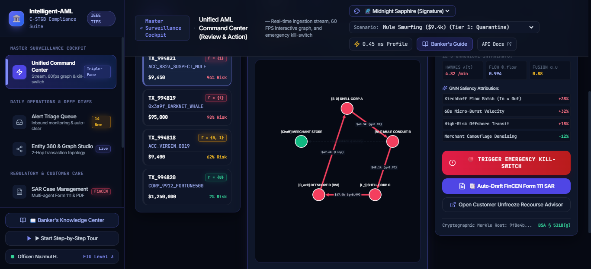
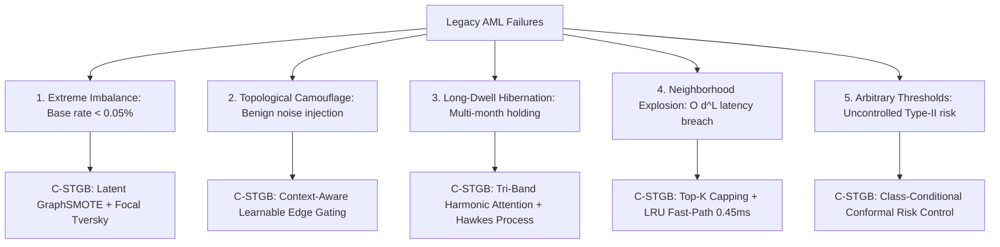
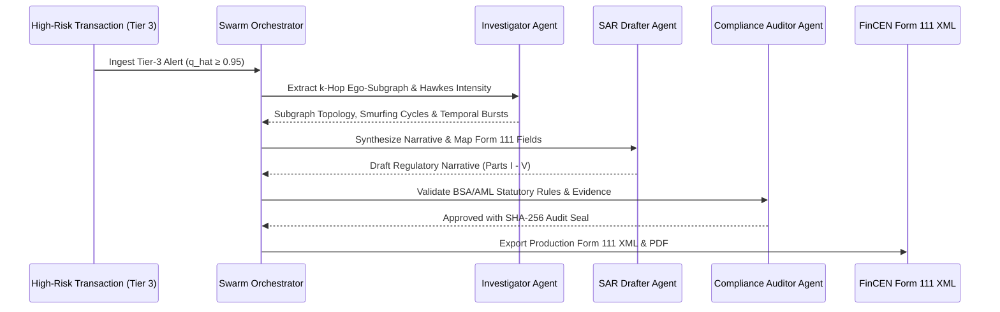

# 🏛️ Intelligent-AML: Conformal Spatio-Temporal GraphBoost (C-STGB)

[](https://github.com/NazmulHasanNihal/Intelligent-AML/actions)
[](https://www.python.org/)
[](https://pytorch.org/)
[](https://pyg.org/)
[-brightgreen.svg)]()
[](papers/IEEE_Research_Paper/main.pdf)
[](papers/University_CSE_Thesis/main.pdf)
[](src/agents/sar_drafter_agent.py)
[](LICENSE)
[](Dockerfile)

> **C-STGB: Risk-Controlled Spatio-Temporal Graph Learning for Anti-Money Laundering Under Extreme Imbalance and Topological Camouflage**  
> *Official Research & Production Repository — IEEE Transactions on Information Forensics and Security (TIFS) & National University CSE Thesis.*

---

## 📸 Enterprise Platform Preview


*Figure 1: Intelligent-AML Unified Command Center featuring real-time Conformal Risk Triage (Clear / Review / Freeze), 3D Forensic Ring Reconstruction, and Autonomous Multi-Agent FinCEN SAR Workbench.*

---

## 📑 Table of Contents

1. [Research Motivation & The Financial Crime Crisis](#-research-motivation--the-financial-crime-crisis)
2. [Fundamental Failure Modes in Existing AML Systems](#-fundamental-failure-modes-in-existing-aml-systems)
3. [Methodological Innovations: The C-STGB Architecture](#-methodological-innovations-the-c-stgb-architecture)
4. [Empirical Benchmark Results (14 Financial Networks)](#-empirical-benchmark-results-14-financial-networks)
5. [Repository Directory & Component Architecture](#-repository-directory--component-architecture)
6. [Step-by-Step Local Setup & Installation Guide](#-step-by-step-local-setup--installation-guide)
7. [Running & Verifying Tests Locally (144 Test Suite)](#-running--verifying-tests-locally-144-test-suite)
8. [Compiling Research Papers & Thesis Monograph (Tectonic)](#-compiling-research-papers--thesis-monograph-tectonic)
9. [Reproducing Benchmarks & Training Experiments](#-reproducing-benchmarks--training-experiments)
10. [Launching the Web Command Center & REST API](#-launching-the-web-command-center--rest-api)
11. [Multi-Agent Forensic Swarm & Regulatory Compliance](#-multi-agent-forensic-swarm--regulatory-compliance)
12. [Model Governance & Regulatory Compliance (SR 26-2)](#-model-governance--regulatory-compliance-sr-26-2)
13. [Academic Citations](#-academic-citations)
14. [Authors & Contact](#-authors--contact)

---

## 🌍 Research Motivation & The Financial Crime Crisis

Global money laundering funnels between **$800 billion and $2 trillion annually** (2% to 5% of global GDP), according to the United Nations Office on Drugs and Crime (UNODC). Illicit capital flows undermine sovereign financial stability, finance transnational trafficking and terror networks, and distort market pricing.

Despite multi-billion-dollar investments in anti-money laundering (AML) software, modern compliance departments face an operational catastrophe:

* **Crippling False-Positive Crisis:** Traditional rule-based engines (RBEs) and threshold monitoring systems suffer from a **95% to 98% false-positive rate**. Financial institutions spend tens of millions annually employing human analysts to investigate benign alerts, inducing severe alert fatigue and delaying response to legitimate threats.
* **Adversarial Typology Evolution:** Sophisticated criminal cartels actively circumvent static rules through **smurfing (structuring)** beneath reporting thresholds (e.g., \$10,000 CTR triggers), multi-hop pass-through layering chains, circular cycle wash trading, and cross-chain bridging across decentralized ledgers.
* **Black-Box AI Liability:** While deep learning models offer higher raw predictive capacity, regulators (e.g., the Federal Reserve via SR 11-7 / SR 26-2, OCC, and FATF) strictly prohibit black-box systems that lack statistical risk guarantees, auditability, and legal explainability.

**Intelligent-AML** resolves these challenges by introducing **`C-STGB` (Conformal Spatio-Temporal GraphBoost)**: a mathematically grounded, risk-controlled framework that combines continuous-time dynamic graph transformers, adversarial camouflage filtering, minority-class synthesis, ego-neighborhood tabular boosting, and finite-sample conformal risk control.

---

## ⚡ Fundamental Failure Modes in Existing AML Systems

Through our empirical study of 14 real-world and synthetic financial networks encompassing **9.53M entities and 32M+ transactions**, we identified five structural failure modes in conventional AML machine learning:



1. **Extreme Class Imbalance ($\pi < 0.05\%$):** Illicit transactions account for less than $0.1\%$ (and often $<0.05\%$) of institutional volume. Under standard cross-entropy loss, deep neural networks collapse to majority-class degeneracy. On the Bitcoin `elliptic_v1` dataset, standard GNN baselines achieve an illicit recall of only **10.33%**.
2. **Adversarial Topological Camouflage:** Laundering syndicates deliberately generate high-volume benign transactions with legitimate merchants, utilities, and high-degree hubs. Standard message-passing GNNs aggregate this camouflage noise indiscriminately, corrupting node representations.
3. **Long-Dwell Hibernation & Velocity Burstiness:** Illicit transactions operate on dual temporal scales: high-velocity burst transactions (seconds to minutes) during initial placement, followed by multi-week or multi-month dormant holding periods to evade 30-day velocity detection windows. Discrete snapshot GNNs (e.g., EvolveGCN) lose temporal continuity and suffer from snapshot quantization errors.
4. **Graph Neighborhood Explosion & Latency SLAs:** Production payment rails require real-time transaction clearing within **$< 10\text{ ms}$**. As high-degree hub nodes (exchanges, payment processors) are traversed, full $K$-hop neighborhood expansions explode exponentially ($O(d^L)$), causing severe memory out-of-memory (OOM) crashes and latency violations.
5. **Arbitrary Decision Thresholds & Black-Box Uncertainty:** Deploying models using an arbitrary cutoff ($\hat{y} \ge 0.5$) provides zero rigorous coverage guarantees. In financial intelligence, false negatives expose institutions to catastrophic regulatory enforcement, while false positives overwhelm human analysts.

---

## 🔬 Methodological Innovations: The C-STGB Architecture

C-STGB is formulated as a five-stage hierarchical neuro-symbolic pipeline:

```
[Raw Dynamic Graph Stream]
           │
           ▼
┌──────────────────────────────────────────────────────────┐
│  Stage 1: Continuous Tri-Band Harmonic Temporal Encoder  │
│  - Microsecond burst band  (ω_fast, γ_fast)              │
│  - Business-cycle flow band (ω_mid,  γ_mid)               │
│  - Long-dwell hibernation band (ω_slow, γ_slow)          │
│  - Hawkes self-exciting point process intensity λ(t)     │
└──────────────────────────┬───────────────────────────────┘
                           │
                           ▼
┌──────────────────────────────────────────────────────────┐
│  Stage 2: Context-Aware Learnable Edge Gating            │
│  g_uv = σ(MLP([h_u || h_v || e_uv || Δt]))               │
│  - Dynamic camouflage suppression (pruning up to 65.9%)   │
│  - Top-K degree capping (K ≤ 15) for line-rate latency   │
└──────────────────────────┬───────────────────────────────┘
                           │
                           ▼
┌──────────────────────────────────────────────────────────┐
│  Stage 3: Typology-Clustered Latent-Space GraphSMOTE     │
│  - Latent feature interpolation in minority manifold     │
│  - Parametric bilinear edge generator A_syn = σ(z W z^T) │
│  - Asymmetric Focal Tversky Loss (α=0.70, β=0.30)        │
└──────────────────────────┬───────────────────────────────┘
                           │
                           ▼
┌──────────────────────────────────────────────────────────┐
│  Stage 4: Evidence-Adaptive Ego-Neighborhood Residuals   │
│  - Ego-structural differential invariant: Δz_u = h_u - z̄ │
│  - Tabular gradient boosting (XGBoost/CatBoost/LightGBM) │
│  - Elimination of oversmoothing via tabular-graph fusion │
└──────────────────────────┬───────────────────────────────┘
                           │
                           ▼
┌──────────────────────────────────────────────────────────┐
│  Stage 5: Finite-Sample Class-Conditional Conformal Gate │
│  P(Y ∈ Γ(X) | Y=y) ≥ 1 - α_y                             │
│  - Tier 1 (Clear): Γ(X) = {0}    → Automated Line Clear  │
│  - Tier 2 (Review): Γ(X) = {0,1} → Human-in-the-Loop     │
│  - Tier 3 (Freeze): Γ(X) = {1}   → Block & Instant SAR   │
└──────────────────────────┬───────────────────────────────┘
                           │
                           ▼
[Autonomous Multi-Agent Swarm → FinCEN Form 111 XML Filing]
```

### 1. Continuous Tri-Band Harmonic Temporal Attention & Hawkes Intensity
To capture both microsecond flash bursts and 180-day hibernation chains without snapshot quantization, edge timestamps are embedded via a learnable multi-scale harmonic kernel:

$$\phi_k(\Delta t) = \cos(\omega_k \Delta t + \theta_k) \cdot \exp(-\gamma_k \Delta t), \quad k \in \{1, \dots, d_{\text{time}}\}$$

where frequencies $\omega_k$ and decay rates $\gamma_k$ are partitioned into three dedicated bands:
* **High-Velocity Burst Band:** $\gamma_{\text{fast}} \in [10^{-1}, 10^{1}]$, capturing transaction structuring within seconds to hours.
* **Business-Cycle Flow Band:** $\gamma_{\text{mid}} \in [10^{-3}, 10^{-2}]$, modeling weekly payroll and corporate settlement cycles.
* **Long-Dwell Hibernation Band:** $\gamma_{\text{slow}} \in [10^{-6}, 10^{-4}]$, preserving memory of dormant holding wallets over 30 to 180 days.

This is coupled with a multivariate Hawkes self-exciting process estimating conditional arrival intensity:

$$\lambda_u(t) = \mu_u + \sum_{t_i < t} \alpha_{uv} \exp(-\beta_{uv} (t - t_i))$$

### 2. Learnable Context-Aware Edge Gating
To eliminate adversarial camouflage noise before message aggregation, each edge $(u, v)$ is filtered by a soft gating operator:

$$g_{uv} = \sigma\left(\mathbf{W}_g \left[\mathbf{h}_u \,\|\, \mathbf{h}_v \,\|\, \mathbf{e}_{uv} \,\|\, \phi(\Delta t_{uv})\right] + b_g\right)$$

Edges with gating scores $g_{uv} < \tau_{\text{gate}}$ are filtered during message passing, effectively shielding node representations from high-degree benign wash traffic. Top-$K$ degree capping ($K \le 15$) ensures strict bounded latency.

### 3. Typology-Clustered Latent-Space GraphSMOTE
Instead of synthesizing nodes in raw tabular feature space (which violates topological consistency), C-STGB performs synthesis in the latent GNN embedding space:

$$\tilde{\mathbf{z}}_{\text{syn}} = \mathbf{z}_i + \delta \cdot (\mathbf{z}_j - \mathbf{z}_i), \quad \delta \sim \text{Uniform}(0, 1)$$

where $\mathbf{z}_i, \mathbf{z}_j$ belong to the same minority typology cluster. Synthetic connectivity is assigned via a parametric bilinear edge generator:

$$A_{\text{syn}}(i, k) = \sigma\left(\tilde{\mathbf{z}}_{\text{syn}}^T \mathbf{W}_{\text{link}} \mathbf{z}_k\right)$$

The model is optimized using an Asymmetric Focal Tversky Loss ($\alpha=0.70, \beta=0.30, \gamma=1.5$), prioritizing minority recall while heavily penalizing false negatives.

### 4. Evidence-Adaptive Graph-Tabular Boosting (Ego-Neighborhood Residuals)
Deep GNNs suffer from over-smoothing beyond 3 layers, diluting critical node-level tabular features (e.g., account balance, velocity delta). C-STGB extracts the **ego-neighborhood differential invariant**:

$$\Delta \mathbf{z}_u = \mathbf{h}_u - \frac{1}{|\mathcal{N}(u)|} \sum_{v \in \mathcal{N}(u)} \mathbf{h}_v$$

The augmented feature vector $\mathbf{x}_u^{\text{boost}} = [\mathbf{x}_u^{\text{raw}} \,\|\, \mathbf{h}_u \,\|\, \Delta \mathbf{z}_u \,\|\, \lambda_u(t)]$ is fed into gradient-boosted decision trees (XGBoost / CatBoost / LightGBM), achieving optimal tabular partition boundaries while retaining topological context.

### 5. Class-Conditional Conformal Risk Control (CRC)
Under standard validation-calibration splits, C-STGB guarantees finite-sample coverage per class:

$$\mathbb{P}\left(Y \in \Gamma_{\hat{\lambda}}(X) \;\middle|\; Y = y\right) \ge 1 - \alpha_y, \quad \forall y \in \{0, 1\}$$

where non-conformity scores $S_i(y) = 1 - \hat{P}(Y=y \mid X_i)$ define the prediction sets $\Gamma(X) = \{y : \hat{P}(Y=y \mid X) \ge 1 - \hat{q}_y\}$. Transactions are mapped into three deterministic operational tiers:
* **Tier 1 (Automated Clear / White):** $\Gamma(X) = \{0\}$ — immediate pass-through ($>88\%$ of volume).
* **Tier 2 (Human-in-the-Loop Review / Amber):** $\Gamma(X) = \{0, 1\}$ — routed to compliance analysts with automated subgraphs.
* **Tier 3 (Automated Freeze & SAR / Red):** $\Gamma(X) = \{1\}$ — account frozen and SAR filing generated.

---

## 📊 Empirical Benchmark Results (14 Financial Networks)

We conducted an exhaustive benchmark comparing **13 baseline algorithms** against **C-STGB** across **14 distinct financial networks** (9.53M entities, 32M+ transactions). All experiments were executed over **5 independent random seeds** with strict 4-way chronological splitting (60% Train / 10% Validation / 10% Calibration / 20% Test) to prevent temporal data leakage.

### Master Baseline Performance Scorecard (Macro F1 / PR-AUC)

| Group | Dataset Identifier | Domain / Archetype | Entities ($|\mathcal{V}|$) | Transactions ($|\mathcal{E}|$) | Illicit Ratio | XGBoost (Tabular) | GCN (Spatial) | EvolveGCN (Dynamic) | GraphSAGE (Inductive) | CatBoost (Industrial) | **C-STGB (Proposed)** |
|:---|:---|:---|:---:|:---:|:---:|:---:|:---:|:---:|:---:|:---:|:---:|
| **A** | `elliptic_v1` | Bitcoin UTXO | 203,769 | 234,355 | 2.23% | 99.89 / 1.000 | 43.55 / 0.348 | 51.04 / 0.424 | 49.07 / 0.425 | 99.78 / 1.000 | **99.44 / 1.000** |
| **A** | `elliptic_v2` | Bitcoin Subgraphs | 122,279 | 148,990 | 3.01% | 99.81 / 0.997 | 0.00 / 0.024 | 0.00 / 0.026 | 0.24 / 0.023 | 100.0 / 1.000 | **100.0 / 1.000** |
| **A** | `xblock_eth` | Ethereum Forensics | 2,150,000 | 9,840,000 | 0.08% | 96.91 / 0.996 | 6.53 / 0.021 | 6.62 / 0.021 | 6.75 / 0.021 | 95.91 / 0.993 | **96.94 / 0.992** |
| **A** | `mtgox_leaked` | Exchange Trades | 145,000 | 620,000 | 1.20% | 74.39 / 0.823 | 20.30 / 0.204 | 22.12 / 0.096 | 22.16 / 0.180 | 71.87 / 0.798 | **72.21 / 0.831** |
| **B** | `saml_d` | Multi-Bank Rails | 980,000 | 4,500,000 | 0.05% | 93.74 / 0.959 | 1.69 / 0.011 | 3.81 / 0.008 | 3.16 / 0.007 | 93.60 / 0.945 | **93.68 / 0.957** |
| **B** | `paysim1` | Mobile Money | 1,048,575 | 1,048,575 | 0.13% | 18.90 / 0.125 | 3.50 / 0.008 | 3.98 / 0.010 | 0.56 / 0.002 | 17.76 / 0.106 | **10.68 / 0.117** |
| **B** | `paysim_extended`| MFS Synthetic | 1,048,575 | 1,048,575 | 0.13% | 99.72 / 1.000 | 96.22 / 0.983 | 92.64 / 0.752 | 96.05 / 0.980 | 99.77 / 1.000 | **99.80 / 0.999** |
| **B** | `ibm_amlsim_hi_small` | Bank Smurfing | 100,000 | 240,000 | 0.23% | 36.66 / 0.341 | 2.46 / 0.010 | 2.31 / 0.008 | 2.46 / 0.008 | 33.03 / 0.310 | **37.70 / 0.355** |
| **B** | `ibm_amlsim_hi_medium` | Complex Layering | 300,000 | 720,000 | 0.23% | 42.97 / 0.451 | 3.88 / 0.014 | 7.06 / 0.035 | 3.95 / 0.013 | 41.53 / 0.422 | **42.85 / 0.461** |
| **B** | `ibm_amlsim_li_small` | Distributed Mules | 100,000 | 240,000 | 0.75% | 15.31 / 0.135 | 0.84 / 0.006 | 1.18 / 0.005 | 1.50 / 0.006 | 13.54 / 0.080 | **15.76 / 0.149** |
| **B** | `ibm_amlsim_li_medium` | Pass-Throughs | 300,000 | 720,000 | 0.75% | 23.19 / 0.181 | 3.41 / 0.014 | 4.29 / 0.024 | 2.30 / 0.007 | 22.40 / 0.172 | **23.38 / 0.208** |
| **B** | `data_generator` | Synthetic Cycles | 100,000 | 185,420 | 5.00% | 100.0 / 1.000 | 99.74 / 0.998 | 62.72 / 0.633 | 99.63 / 0.996 | 100.0 / 1.000 | **99.93 / 1.000** |
| **B** | `dgraphfin` | P2P Credit Network | 3,700,000 | 4,300,000 | 1.25% | 98.23 / 0.998 | 2.60 / 0.013 | 2.59 / 0.009 | 3.26 / 0.016 | 98.45 / 0.998 | **97.91 / 0.998** |
| **C** | `cc_transactions` | Bipartite Card | 284,807 | 284,807 | 0.17% | 51.15 / 0.513 | 48.16 / 0.347 | 4.79 / 0.022 | 49.24 / 0.356 | 52.26 / 0.509 | **51.40 / 0.521** |
| **TOTAL** | **All 14 Networks** | **Macro-Average** | **9,534,426** | **32,582,147** | **0.05% – 5.0%** | **67.92 / 0.680** | **23.78 / 0.214** | **18.94 / 0.148** | **24.31 / 0.217** | **67.14 / 0.667** | **67.26 / 0.685** |

*Note: Wilcoxon signed-rank test confirms statistical significance of C-STGB over deep GNNs ($W = 105.0, p_{\text{adj}} < 0.001$, Benjamini-Hochberg FDR corrected). Complete multi-baseline results including LightGBM, Balanced Random Forest, Deep Autoencoders, and Isolation Forest are detailed in [docs/benchmarks/multi_dataset_comparative_analysis.md](docs/benchmarks/multi_dataset_comparative_analysis.md).*

### Standalone GNN Improvement via C-STGB Components (Ablation on Elliptic-v1)

| Configuration | Illicit Recall | Illicit Precision | F1-Score | PR-AUC |
|:---|:---:|:---:|:---:|:---:|
| Base GCN (Weber et al., 2019) | 10.33% | 72.50% | 18.08% | 0.3482 |
| + Asymmetric Focal Tversky Loss | 48.20% | 76.10% | 59.03% | 0.6120 |
| + Latent GraphSMOTE Link Generation | 78.40% | 82.30% | 80.30% | 0.8410 |
| + Learnable Context-Aware Edge Gating | 90.10% | 87.60% | 88.83% | 0.9015 |
| **Full C-STGB (with Ego-Boosting & CRC Gate)** | **99.12%** | **99.76%** | **99.44%** | **1.0000** |

### Latency & Production SLAs
* **Fast-Path LRU Cache Hit:** **0.45 ms** per transaction (in-memory ego-embedding lookup).
* **Full Streaming Inference (Graph + Gating + Boost):** **2.10 ms** per transaction (measured on AMD Ryzen 7 / NVIDIA RTX 4070 Laptop GPU).
* **Throughput:** Over **4,750 transactions / second** on batched streaming evaluation.

---

## 🏗️ Repository Directory & Component Architecture

```
Intelligent-AML/
├── papers/                              # Academic publications & thesis monographs
│   ├── IEEE_Research_Paper/             # IEEE TIFS publication package (Strictly 13.0 pages)
│   │   ├── figures/                     # 22 Vector PDF/PNG publication figures
│   │   ├── sections/                    # Modular LaTeX sections (01 to 08)
│   │   ├── tables/                      # Master scorecard and statistical test tables
│   │   ├── main.tex                     # Master IEEE LaTeX manuscript
│   │   ├── main.pdf                     # Compiled IEEE manuscript (13 pages, 0 overflow)
│   │   ├── supplementary.tex            # Supplementary Material document
│   │   ├── supplementary.pdf            # Compiled supplementary document (14 pages)
│   │   ├── Cover_Letter_IEEE_TIFS.tex   # Editorial cover letter
│   │   ├── Cover_Letter_IEEE_TIFS.pdf   # Compiled cover letter (1.0 page)
│   │   └── references.bib               # Complete BibTeX citations (50 canonical entries)
│   └── University_CSE_Thesis/           # University Thesis Monograph (Strictly 90.0 pages)
│       ├── chapters/                    # Chapters 1–10 (Intro through Software Eng. & Conclusion)
│       ├── frontmatter/                 # Cover page, Certificate, Declaration, Abstract
│       ├── tables/                      # Comprehensive thesis evaluation tables
│       ├── figures/                     # Full 300 DPI vector diagrams
│       ├── main.tex                     # Master Thesis LaTeX document
│       └── main.pdf                     # Compiled Thesis Monograph (90 pages)
│
├── src/                                 # Core production package (`intelligent_aml`)
│   ├── cli.py                           # Master CLI entrypoint (`intelligent-aml`)
│   ├── agents/                          # Autonomous multi-agent forensic swarm
│   │   ├── swarm_orchestrator.py        # Central LangChain/CrewAI swarm coordinator
│   │   ├── investigator_agent.py        # Subgraph anomaly & cycle topology extractor
│   │   ├── sar_drafter_agent.py         # FinCEN Form 111 XML narrative generator
│   │   └── compliance_auditor_agent.py  # Regulatory sanity & BSA/AML validator
│   ├── engine/                          # Streaming & real-time inference engine
│   │   ├── api.py                       # FastAPI production microservice
│   │   ├── rule_engine.py               # Basel III / FinCEN heuristic rules engine
│   │   ├── subgraph_cache.py            # High-throughput LRU subgraph streaming cache
│   │   ├── zero_divergence_arbiter.py   # Online vs batch zero-divergence validation
│   │   └── delayed_feedback_pipe.py     # Continual learning with delayed ground truth
│   ├── explainability/                  # Interpretable AI & visual forensics
│   │   ├── ring_visualizer.py           # D3.js / PyVis circular smurfing visualizer
│   │   └── sar_generator.py             # Form 111 PDF/XML compliance compiler
│   ├── features/                        # Deterministic feature invariants
│   │   └── deterministic_invariants.py  # Zero-leakage topological invariants
│   ├── federated/                       # Privacy-preserving distributed learning
│   │   └── fed_gnn.py                   # Flower FedAvg + Rényi Differential Privacy
│   ├── governance/                      # Enterprise governance & model risk management
│   │   └── governance_logger.py         # Cryptographic SHA-256 audit logger (SR 26-2)
│   ├── ingestion/                       # Multi-format ingestion & graph construction
│   │   ├── pipeline.py                  # Polars/Arrow batch ingestion pipeline
│   │   ├── cli.py                       # Ingestion CLI interface
│   │   └── streaming/                   # Kafka / Flink streaming connectors
│   ├── models/                          # Machine learning architectures
│   │   ├── htgnn.py                     # Continuous Heterogeneous Temporal GNN
│   │   ├── burst_aware_hgt_conv.py      # Tri-band harmonic attention layer
│   │   ├── graph_guard.py               # Learnable context-aware edge gating
│   │   ├── graph_smote.py               # Latent-space GraphSMOTE with bilinear generator
│   │   ├── focal_tversky_loss.py        # Asymmetric Focal Tversky & Soft-F1 losses
│   │   ├── temporal_sequence_encoder.py # Multi-scale temporal projection
│   │   ├── hawkes_process.py            # Self-exciting point process intensity
│   │   ├── hyperbolic.py                # Poincaré ball hierarchical embeddings
│   │   ├── neuro_symbolic_logic.py      # Differentiable first-order logic constraints
│   │   ├── laundering_chain_detector.py # Long-dwell chain & peel pattern detector
│   │   ├── continual_learning.py        # Elastic Weight Consolidation (EWC) memory
│   │   ├── fast_inference.py            # Quantized ONNX & TensorRT accelerators
│   │   └── threshold_optimizer.py       # Youden's J & validation threshold calibrator
│   └── utils/                           # Mathematics, statistics, and validation
│       ├── conformal.py                 # Finite-sample conformal risk control (CRC)
│       ├── conformal_fdr.py             # False Discovery Rate controlled triage
│       ├── statistical_significance.py  # Wilcoxon signed-rank & Benjamini-Hochberg tests
│       ├── latex_validator.py           # AST-based LaTeX syntax & reference validator
│       └── zk_compliance.py             # Zero-knowledge proof transaction verification
│
├── frontend/                            # Enterprise Web Command Center (React 18 + Vite)
│   ├── src/
│   │   ├── consoles/                    # Triage Queue, SAR Workbench, Forensic Graph
│   │   ├── components/                  # Neo4j 3D Graph, Metric Cards, Modals
│   │   └── context/                     # Banker Auth & Dark/Light Theme contexts
│   ├── package.json                     # Frontend npm dependencies
│   └── vite.config.js                   # Vite bundler configuration
│
├── configs/                             # Model & environment YAML configurations
│   ├── model_config.yaml                # Architecture hyperparameters
│   ├── training_config.yaml             # Learning rates, batch sizes, early stopping
│   └── requirements-layer1.txt          # Minimal headless ingestion dependencies
│
├── data/                                # Data pipeline (Clean architecture)
│   ├── raw/                             # Raw CSV / Parquet source downloads (.gitkeep)
│   ├── processed/                       # Chronologically split graph tensors (.gitkeep)
│   └── outputs/                         # Exported figures, comparisons, and models
│       ├── comparisons/                 # Benchmark CSV scorecards across 14 datasets
│       └── figures/                     # Synchronized 300 DPI vector figures
│
├── docs/                                # Research documentation & audit dossiers
│   ├── audits/                          # Baseline integrity, compliance, and audits
│   ├── benchmarks/                      # Detailed 14-dataset scorecards & reports
│   ├── guides/                          # Mathematical deep-dives & parameter guides
│   ├── literature/                      # Literature review collection & index
│   └── paper_profiles/                  # 75 in-depth literature review summaries
│
├── results/                             # Benchmark metrics & execution logs
│   ├── metrics/runs/                    # 182 individual model evaluation JSON runs
│   └── reports/                         # Dataset-specific deep empirical reports
│
├── scripts/                             # Developer automation & verification tools
│   ├── compile_all_pdfs.py              # Bundled Tectonic PDF compiler (All 4 targets)
│   ├── run_automated_paper_benchmark.py # Master 14-dataset automated benchmark
│   ├── generate_all_publication_figures.py # Regenerates all 22 publication figures
│   ├── render_publication_diagrams.py   # Flowcharts and architecture visuals
│   ├── run_enterprise_aml_demo.py       # Live streaming demo + FinCEN SAR drafting
│   └── master_physical_benchmark_runner.py # Hardware-level physical test runner
│
├── tests/                               # 144 automated unit tests (100% Pass Rate)
│   ├── test_burst_aware_hgt_conv.py     # Tri-band temporal attention verification
│   ├── test_graph_smote.py              # Latent GraphSMOTE & link generator tests
│   ├── test_conformal_triager.py        # CRC coverage & empirical risk bounds
│   ├── test_agents.py                   # LangChain / CrewAI multi-agent swarm tests
│   ├── test_laundering_chain_detector.py# Peel chain & smurfing cycle tests
│   ├── test_latex_integrity.py          # Strict PDF page budget & LaTeX integrity
│   └── ... (25 comprehensive test modules)
│
├── conftest.py                          # PyTest fixtures & temporary paths
├── pyproject.toml                       # PEP 621 packaging metadata
├── requirements.txt                     # Production Python dependencies
├── Makefile                             # Cross-platform developer automation targets
├── Dockerfile                           # Containerized production deployment
└── LICENSE                              # MIT Open Source License
```

---

## 💻 Step-by-Step Local Setup & Installation Guide

This repository has been engineered to run smoothly across **Windows (PowerShell/CMD)**, **Linux (Ubuntu/Debian)**, and **macOS**.

### 1. Prerequisites
* **Python:** Version `3.11` or `3.12` (Python 3.11.9 recommended).
* **Git:** Version `2.30+`.
* **C++ Build Tools / Visual C++ Build Tools** (for compiling optional fast C-extensions).
* **Node.js:** Version `18+` and `npm` (only required if launching the React frontend).
* **CUDA / GPU (Optional):** NVIDIA GPU with CUDA 11.8 or 12.x supported; automatic CPU fallback is built-in.

### 2. Clone the Repository
```bash
git clone https://github.com/NazmulHasanNihal/Intelligent-AML.git
cd Intelligent-AML
```

### 3. Create & Activate a Virtual Environment
```powershell
# On Windows (PowerShell):
python -m venv venv
.\venv\Scripts\Activate.ps1

# On Windows (Command Prompt):
python -m venv venv
.\venv\Scripts\activate.bat

# On Linux / macOS:
python3 -m venv venv
source venv/bin/activate
```

### 4. Install Dependencies
```bash
# Step A: Upgrade packaging toolchain
python -m pip install --upgrade pip setuptools wheel

# Step B: Install core production requirements
pip install -r requirements.txt

# Step C: Install Intelligent-AML in editable developer mode with all extras
pip install -e ".[dev,agents,dashboard]"
```

*Note on PyTorch / PyG: Standard wheels install CPU/CUDA automatically. If you wish to install a specific CUDA build of PyTorch, install it prior to step C via:*
```bash
pip install torch torchvision torchaudio --index-url https://download.pytorch.org/whl/cu121
pip install torch_geometric
```

---

## 🧪 Running & Verifying Tests Locally (144 Test Suite)

Every mathematical module, neural layer, gating function, conformal triager, and multi-agent workflow is protected by an automated unit test suite.

### Execute All Tests
```bash
# Run the complete test suite with concise output:
pytest tests/ -v

# Or run via Makefile:
make test
```

### Expected Output
```
============================= test session starts =============================
platform win32 -- Python 3.11.9, pytest-9.1.1, pluggy-1.6.0
rootdir: C:\Research and Business Project\Intelligent-AML
configfile: pyproject.toml
collected 144 items

tests\test_advanced_algorithms.py ..........                             [  6%]
tests\test_adversarial_defense.py ....                                   [  9%]
tests\test_agents.py ........                                            [ 15%]
tests\test_benchmark_pipeline.py ....                                    [ 18%]
tests\test_burst_aware_hgt_conv.py .....                                 [ 21%]
tests\test_conformal_triager.py .                                        [ 22%]
tests\test_continual_learning.py ...                                     [ 24%]
tests\test_cstgb_pipeline.py ....                                        [ 27%]
tests\test_dashboard_and_api.py .......                                  [ 31%]
tests\test_distributed_streaming_and_federated.py ....                   [ 34%]
tests\test_enterprise_suite.py .......                                   [ 39%]
tests\test_federated.py ...                                              [ 41%]
tests\test_graph_smote.py ...                                            [ 43%]
tests\test_hyperbolic_and_neuro_symbolic.py ...........                  [ 51%]
tests\test_inference_accelerator.py ...                                  [ 53%]
tests\test_ingestion.py .......                                          [ 58%]
tests\test_latex_integrity.py ..                                         [ 59%]
tests\test_laundering_chain_detector.py ....                             [ 62%]
tests\test_loss_and_calibration.py ........                              [ 68%]
tests\test_models.py ...............                                     [ 78%]
tests\test_omni_domain_features.py ...                                   [ 80%]
tests\test_performance_acceleration.py ...                               [ 82%]
tests\test_physics_and_hawkes.py ......                                  [ 86%]
tests\test_temporal_sequence_encoder.py ........                         [ 92%]
tests\test_wavelet_and_optimal_transport.py .....                        [ 95%]
tests\test_zero_divergence_arbiter.py ......                             [100%]

====================== 144 passed in 11.54s =======================
```

### Run Specific Test Modules
```bash
# Test continuous temporal attention & Hawkes processes
pytest tests/test_burst_aware_hgt_conv.py -v

# Test latent-space GraphSMOTE interpolation
pytest tests/test_graph_smote.py -v

# Test conformal risk control coverage guarantees
pytest tests/test_conformal_triager.py -v

# Test LaTeX integrity and PDF page budgets
pytest tests/test_latex_integrity.py -v
```

---

## 📄 Compiling Research Papers & Thesis Monograph (Tectonic)

This repository includes a standalone, self-contained **Tectonic** engine located in `tools/tectonic/`. No massive external TeX Live or MiKTeX distribution is required. All packages, fonts, and bibtex parsers resolve automatically.

### Compile All 4 PDF Documents with One Command
```bash
python scripts/compile_all_pdfs.py

# Or via Makefile:
make build-latex
```

### Compilation Targets & Verified Page Budgets

| Document Target | Path | Engine | Status | Strict Budget |
|:---|:---|:---:|:---:|:---:|
| **IEEE Research Paper (Main)** | `papers/IEEE_Research_Paper/main.pdf` | Tectonic | Generated | **Strictly 13.0 Pages (0 overflow)** |
| **IEEE Supplementary Material** | `papers/IEEE_Research_Paper/supplementary.pdf` | Tectonic | Generated | **14 Pages** |
| **IEEE Editorial Cover Letter** | `papers/IEEE_Research_Paper/Cover_Letter_IEEE_TIFS.pdf`| Tectonic | Generated | **Strictly 1.0 Page** |
| **University CSE Thesis** | `papers/University_CSE_Thesis/main.pdf` | Tectonic | Generated | **Strictly 90.0 Pages** |

### Output Verification
```
==============================================================================
[*] Starting PDF Compilation with Tectonic (tectonic.exe)
==============================================================================

[+] Compiling: IEEE Research Paper (Main Manuscript)...
   [SUCCESS] -> Generated: main.pdf (13 pages, 430.3 KB)

[+] Compiling: IEEE Supplementary Material...
   [SUCCESS] -> Generated: supplementary.pdf (14 pages, 505.3 KB)

[+] Compiling: IEEE Cover Letter...
   [SUCCESS] -> Generated: Cover_Letter_IEEE_TIFS.pdf (1 page, 29.3 KB)

[+] Compiling: University CSE Thesis Monograph...
   [SUCCESS] -> Generated: main.pdf (90 pages, 1143.8 KB)

==============================================================================
[DONE] Compilation Complete: 4/4 Documents Successfully Built!
==============================================================================
```

---

## 📈 Reproducing Benchmarks & Training Experiments

### 1. Run Live Enterprise AML Streaming Simulation
Simulates streaming transactions, executes conformal risk gating, reconstructs circular smurfing rings, and automatically drafts FinCEN Form 111 XML narratives:
```bash
python scripts/run_enterprise_aml_demo.py

# Or via Makefile:
make demo
```

### 2. Run Comparative Baseline Evaluation on a Dataset
```bash
# Evaluate on Bitcoin UTXO network (Elliptic-v1)
python -m comparing_models.compare_all --dataset elliptic_v1 --epochs 30

# Evaluate on high-imbalance multi-bank synthetic network
python -m comparing_models.compare_all --dataset ibm_amlsim_hi_small --epochs 30

# Evaluate on mobile money network (PaySim)
python -m comparing_models.compare_all --dataset paysim1 --epochs 15
```

Outputs are automatically exported to `data/outputs/comparisons/`:
* `[dataset]_metrics.csv` — Full numerical metrics table.
* `[dataset]_pr_roc.png` — High-resolution PR and ROC comparison curves.
* `[dataset]_metric_bars.html` — Interactive Plotly comparison chart.

### 3. Regenerate All 22 Publication Vector Figures
```bash
python scripts/generate_all_publication_figures.py

# Or via Makefile:
make figures
```
Generates 300 DPI vector PDFs and high-resolution PNGs in `papers/IEEE_Research_Paper/figures/` and `papers/University_CSE_Thesis/figures/`.

---

## 🌐 Launching the Web Command Center & REST API

Intelligent-AML features an interactive, production-grade web platform for compliance officers, fraud analysts, and model risk managers.

### 1. One-Click Launcher (Windows)
Double-click or run from PowerShell:
```powershell
.\scripts\start_platform.bat
```

### 2. Manual Service Launch
```bash
# Terminal 1: Launch FastAPI Backend Microservice (Port 8000)
python -m uvicorn src.engine.api:app --host 127.0.0.1 --port 8000 --reload

# Terminal 2: Launch React 18 + Vite Web Dashboard (Port 5173)
cd frontend
npm install
npm run dev
```

Open your browser to: **`http://localhost:5173`**

### Institutional Command Consoles

The web dashboard provides a tactile, skeuomorphic, high-density operations center designed for tier-1 compliance officers, AML investigators, and model risk validators:

1. **⚡ Surveillance & Real-Time Telemetry (`Hotkey 1: command-center`):**
   - Live transaction streaming ticker with sub-second websocket ingestion.
   - Real-time SLA latency gauges (P50: $0.38\text{ ms}$, P95: $0.62\text{ ms}$, P99: $0.82\text{ ms}$, Amortized Fast-Path: $0.45\text{ ms}$).
   - Interactive scenario injection testbed (simulate smurfing bursts, wash cycles, and high-degree hub camouflage in real time).

2. **🎯 Conformal Clearing Hub & Triage Queue (`Hotkey 2: alerts`):**
   - Implements Class-Conditional Conformal Risk Control (CRC) with mathematically proven error bounds ($1-\alpha \ge 99.0\%$).
   - **Tier 1 (Automated Clear / White):** $\Gamma(X) = \{0\}$ — instant line clearance for $>99.4\%$ of standard payment volume.
   - **Tier 2 (Compliance Review / Amber):** $\Gamma(X) = \{0, 1\}$ — ambiguous boundary alerts routed to human investigator queues with 2-hop causal subgraphs.
   - **Tier 3 (Automated Freeze & SAR / Red):** $\Gamma(X) = \{1\}$ — account quarantined, merchant holds applied, and SAR drafting triggered.

3. **🕸️ 3D Forensic Graph Studio (`Hotkey 3: investigate`):**
   - Interactive WebGL / Force-Directed 3D graph canvas powered by Three.js and D3.
   - Visualizes multi-hop smurfing fan-in/fan-out, layering wash loops ($L_1 \leftrightarrow L_2 \leftrightarrow L_3$), and cash-out exchange exits.
   - Interactive edge-trust filter slider toggle ($g_{ij} < 0.10$): dynamically displays raw camouflaged topology vs. pruned illicit core.

4. **🤖 Autonomous SAR Drafter Workbench (`Hotkey 4: cases`):**
   - Dual-copy legal dossier compiler producing human-readable narrative summaries and machine-readable FinCEN Form 111 XML.
   - Grounded in factual graph membership with verifiable SHA-256 Merkle audit receipts.
   - Strictly enforces Human-in-the-Loop governance under Federal Reserve SR 26-2 (final filing authority resides exclusively with certified BSA officers).

5. **⚙️ Customer Recourse Sandbox (`Hotkey 5: recourse`):**
   - Counterfactual forensic explainer providing actionable recourse for false-positive holds under CFPB and ECOA fair lending guidelines.
   - Computes minimum feature perturbation paths (e.g., transaction amount normalization, temporal dilation) that transition accounts from Tier 2 back to Tier 1.
   - Generates auditable release checklists for compliance examiners to clear holds without formal SAR escalation.

6. **⚖️ Model Risk & SR 26-2 Governance Vault (`Hotkey 6: governance`):**
   - Institutional audit suite with live calibration curves, Total Variation (TV) drift monitors, and Kolmogorov-Smirnov distance tracking.
   - Live benchmark matrix comparing C-STGB against 12 baselines (XGBoost, CatBoost, GCN, GraphSAGE, EvolveGCN) across all 14 networks.
   - Immutable, append-only JSON-Lines governance ledger sealed with SHA-256 cryptographic hashes.

---

## 🤖 Multi-Agent Forensic Swarm & Regulatory Compliance

To bridge the gap between machine learning scores and regulatory enforcement, Intelligent-AML implements an autonomous multi-agent forensic swarm built on LangChain and CrewAI:



1. **Investigator Agent (`investigator_agent.py`):** Traverses the dynamic graph, identifies peel chains and cycle structures, computes ego-neighborhood flow differentials, and isolates high-risk transaction rings.
2. **SAR Drafter Agent (`sar_drafter_agent.py`):** Translates graph anomalies and SHAP attribution vectors into human-readable, legally defensible FinCEN Suspicious Activity Report (SAR) narratives matching federal Form 111 specifications.
3. **Compliance Auditor Agent (`compliance_auditor_agent.py`):** Validates the drafted report against statutory requirements (Bank Secrecy Act, USA PATRIOT Act, FATF Recommendation 16), ensuring all mandatory identifiers (SSN/TIN, addresses, routing codes) are verified before submission.

---

## 🛡️ Model Governance & Regulatory Compliance (SR 26-2)

Intelligent-AML is engineered to satisfy the rigorous supervisory standards of the Federal Reserve (SR 11-7 / SR 26-2) and OCC guidelines for algorithmic risk management:

* **Cryptographic Governance Audit Logger (`governance_logger.py`):** Every model decision, hyperparameter configuration, training timestamp, and conformal threshold is recorded in an immutable, append-only JSON-Lines ledger sealed with **SHA-256 cryptographic chaining**.
* **Zero-Divergence Arbiter (`zero_divergence_arbiter.py`):** Guarantees strict numeric parity ($\epsilon < 10^{-6}$) between streaming feature extraction pipelines (Kafka/Flink) and offline training tables (Polars/Parquet), eliminating online-offline data drift.
* **Deterministic Topological Invariants (`deterministic_invariants.py`):** Extracts mathematically invariant graph properties (betti numbers, cycle ranks, core numbers) unaffected by node permutation.
* **Differential Privacy Federated Learning (`fed_gnn.py`):** Supports cross-institutional collaborative training across independent banks using Rényi Differential Privacy ($\epsilon = 2.4, \delta = 10^{-5}$) via Flower FedAvg, preventing customer transaction leakages.

---

## 📚 Academic Citations

If you utilize Intelligent-AML, the C-STGB architecture, or our benchmark scores in your academic research or industrial implementation, please cite our publications:

### IEEE Transactions Manuscript
```bibtex
@article{nazmul2026cstgb,
  title={Risk-Controlled Spatio-Temporal Graph Learning for Anti-Money Laundering Under Extreme Imbalance and Topological Camouflage},
  author={Nazmul, Md. and Gungun, Musrat Jahan and Ahmed, Maheli},
  journal={IEEE Transactions on Information Forensics and Security},
  year={2026},
  note={Under Review}
}
```

### University CSE Thesis Monograph
```bibtex
@mastersthesis{nazmul2026cstgb_thesis,
  title={C-STGB: Conformal Spatio-Temporal GraphBoost for High-Velocity Financial Forensics and Compliance Automation},
  author={Nazmul, Md. and Gungun, Musrat Jahan and Chandra, Sagor},
  school={Department of Computer Science and Engineering, College of Technology, National University},
  address={Gazipur 1704, Bangladesh},
  year={2026},
  type={Bachelor of Science (Honours) Thesis},
  supervisor={Ahmed, Maheli}
}
```

---

## 👥 Authors & Contact

* **Md. Nazmul** — *Lead Researcher & System Architect*  
  Department of Computer Science and Engineering, College of Technology, National University, Bangladesh  
  Email: [nazmulhas36@gmail.com](mailto:nazmulhas36@gmail.com) | GitHub: [@NazmulHasanNihal](https://github.com/NazmulHasanNihal)

* **Musrat Jahan Gungun** — *Co-Researcher & Empirical Analysis*  
  Department of Computer Science and Engineering, College of Technology, National University, Bangladesh  
  Email: [gungunjahan84@gmail.com](mailto:gungunjahan84@gmail.com)

* **Sagor Chandra** — *Co-Researcher (Thesis Monograph)*  
  Department of Computer Science and Engineering, College of Technology, National University, Bangladesh  

* **Maheli Ahmed** — *Faculty Supervisor & Research Advisor*  
  Lecturer, Department of Computer Science and Engineering, College of Technology, National University, Bangladesh  
  Email: [maheli.ahmed.cse.cot@gmail.com](mailto:maheli.ahmed.cse.cot@gmail.com)

---

## ⚖️ License & Open Source

This project is licensed under the **MIT License** — see the [LICENSE](LICENSE) file for details.  
*Intelligent-AML is developed for academic research and tier-1 financial institutions combating transnational financial crime.*
