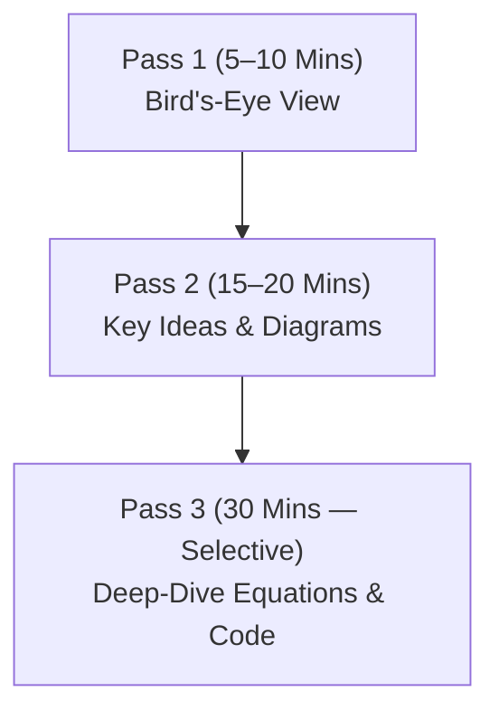

# Strategic Reading Guide for Layer 2: How to Master Research Papers Efficiently

**Author / Project:** Intelligent AML Framework  
**Target:** Mastering Layer 2 (Heterogeneous Temporal GNNs & Class Rebalancing)  
**Methodology:** The 3-Pass Research Reading Strategy (S. Keshav Framework)  

---

## 1. Do You Need to Read ALL Tiers?

**YES — but DO NOT read them cover-to-cover like a textbook.**

Reading a research paper line-by-line from page 1 to 10 is inefficient and leads to information overload. As a researcher building a novel algorithm, your goal is **targeted extraction**: you are reading to steal ideas, identify gaps, and adapt mathematical equations for your own model.

You will use the **3-Pass Reading Method** to read each paper in **20 to 30 minutes**.

---

## 2. The 3-Pass Reading Strategy

### 🔍 Pass 1: The Bird's-Eye View (5 to 10 Minutes)
*Goal: Decide if this paper is directly relevant to your algorithm.*
1. Read the **Title**, **Abstract**, and **Introduction**.
2. Read the **Section Headings** and **Subheadings**.
3. Look at the **Main Architectural Figure** (usually Figure 1 or Figure 2).
4. Read the **Conclusion**.

*At the end of Pass 1, answer:* What problem are they solving? Is this relevant to Layer 2?

---

### 🔬 Pass 2: Key Content Extraction (15 to 20 Minutes)
*Goal: Understand HOW they solved the problem and what they missed.*
1. **Focus on Section 3/4 (Methodology / Proposed Architecture):** Look at the input graph structure and message-passing logic.
2. **Look at the Result Tables:** Which baselines did they beat? What evaluation metrics did they use (PR-AUC, F1)?
3. **Read the Related Work / Research Gaps:** What did they admit their model CANNOT do? (This is where your novelty comes from!).

---

### 📐 Pass 3: Mathematical Deep-Dive (30 Minutes — Core Papers Only)
*Goal: Re-create or adapt their equations for your HT-GNN / GraphGAN model.*
- Only do Pass 3 for **3 core papers**: Hu et al. (`HGT`), Rossi et al. (`TGN`), and Zhao et al. (`GraphSMOTE`).
- Extract the exact attention equations, loss functions, and temporal decay formulations.

---

## 3. What SPECIFIC Sections to Read in Each Tier

When you open any paper from `docs/paper_profiles/`, look ONLY for these 4 specific answers:

| What You Need to Find | Where to Look in the Paper | Why You Need It |
| :--- | :--- | :--- |
| **1. Graph Formulation** | Section 3: Problem Definition | How do they define node types, edge types, and timestamps? |
| **2. Message Passing Equation** | Section 4: Proposed Method | What equation updates node embeddings? (Copy/adapt this for HT-GNN). |
| **3. Class Imbalance Handling** | Section 4.2 / Experiments | How do they deal with 99.9% clean vs 0.1% fraud? |
| **4. Baseline Evaluation** | Section 5: Experiments & Tables | Which baseline models (GCN, GAT, XGBoost) did they compare against? |

---

## 4. Tier-by-Tier Reading Action Plan

### 🎯 Step 1: Read Tier 1 (Domain & Problem Mastery)
*Goal: Understand the financial crime patterns your model must detect.*

1. **[Paper #10] Weber et al. (2019) — Elliptic v1**  
   - 📄 [paper_10_Anti_Money_Laundering_in_Bitcoin_Ex.md](file:///c:/Research%20and%20Business%20Project/Intelligent%20AML/docs/paper_profiles/paper_10_Anti_Money_Laundering_in_Bitcoin_Ex.md)
   - **Focus on:** How they mapped Bitcoin transactions to nodes/edges, and why standard GCNs struggled with dark market vs legal license labels.

2. **[Paper #04] Johannessen & Jullum (2023) — Heterogeneous Bank GNNs**  
   - 📄 [paper_04_Finding_Money_Launderers_Using_Hete.md](file:///c:/Research%20and%20Business%20Project/Intelligent%20AML/docs/paper_profiles/paper_04_Finding_Money_Launderers_Using_Hete.md)
   - **Focus on:** Why multi-entity graphs (Accounts + Devices + Users) perform significantly better than single-account graphs in bank transaction monitoring.

---

### 🎯 Step 2: Read Tier 2 & Tier 3 (Building Your HT-GNN Architecture)
*Goal: Extract the mathematical equations for heterogeneous attention and temporal decay.*

3. **[Paper #01] Hu et al. (2020) — Heterogeneous Graph Transformer (HGT)**  
   - 📄 [paper_01_Heterogeneous_Graph_Transformer_HGT.md](file:///c:/Research%20and%20Business%20Project/Intelligent%20AML/docs/paper_profiles/paper_01_Heterogeneous_Graph_Transformer_HGT.md)
   - **Focus on:** Equation 1 & 2 (Type-specific projection matrices $\mathbf{W}_{\text{node}}$ and $\mathbf{W}_{\text{edge}}$). This is the foundation of your HT-GNN.

4. **[Paper #02] Rossi et al. (2020) — Temporal Graph Networks (TGN)**  
   - 📄 [paper_02_Temporal_Graph_Networks_for_Deep_Le.md](file:///c:/Research%20and%20Business%20Project/Intelligent%20AML/docs/paper_profiles/paper_02_Temporal_Graph_Networks_for_Deep_Le.md)
   - **Focus on:** How continuous timestamps $t$ are embedded using harmonic Fourier encoding or exponential decay.

5. **[Paper #53] Chen & Yang (2026) — Temporal Attention for Fraud**  
   - 📄 [paper_53_Real_Time_Dynamic_Graph_Learning_wi.md](file:///c:/Research%20and%20Business%20Project/Intelligent%20AML/docs/paper_profiles/paper_53_Real_Time_Dynamic_Graph_Learning_wi.md)
   - **Focus on:** The exact temporal attention decay formula $\exp(-\gamma \Delta t)$.

---

### 🎯 Step 3: Read Tier 4 (Building GraphGAN Rebalancing)
*Goal: Learn how to generate synthetic fraud subgraphs to fix class imbalance.*

6. **[Paper #39] Zhao et al. (2021) — GraphSMOTE**  
   - 📄 [paper_39_GraphSMOTE_Imbalanced_Node_Classifi.md](file:///c:/Research%20and%20Business%20Project/Intelligent%20AML/docs/paper_profiles/paper_39_GraphSMOTE_Imbalanced_Node_Classifi.md)
   - **Focus on:** How synthetic node feature interpolation creates new minority class nodes in feature space.

7. **[Paper #12] Bellei et al. (2024) — Subgraph Representation Learning (Elliptic2)**  
   - 📄 [paper_12_The_Shape_of_Money_Laundering_Subgr.md](file:///c:/Research%20and%20Business%20Project/Intelligent%20AML/docs/paper_profiles/paper_12_The_Shape_of_Money_Laundering_Subgr.md)
   - **Focus on:** Structural subgraph patterns (peel chains, fan-out/fan-in subgraphs). Your GraphGAN will generate these exact subgraphs.

---

## 5. Summary Checklist: Your Reading Routine

For each paper you read today:
- [ ] **Pass 1 (5 mins):** Read Title, Abstract, Figure 1, Conclusion.
- [ ] **Pass 2 (15 mins):** Read Methodology & Result Tables.
- [ ] **Note Extraction:** Write down **1 idea to borrow** and **1 limitation to solve** in your notebook.
- [ ] **Move to Next Paper:** Do not spend more than 30 minutes per paper!
